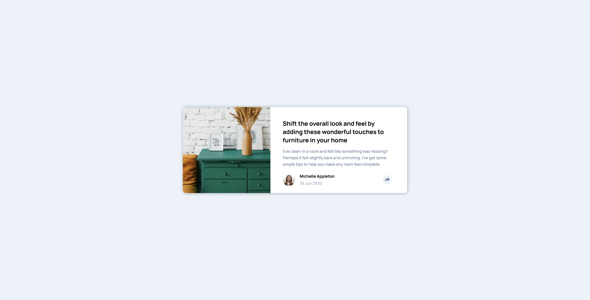

# Frontend Mentor - Article preview component solution

This is a solution to the [Article preview component challenge on Frontend Mentor](https://www.frontendmentor.io/challenges/article-preview-component-dYBN_pYFT). Frontend Mentor challenges help you improve your coding skills by building realistic projects.

## Table of contents

- [Overview](#overview)
  - [The challenge](#the-challenge)
  - [Screenshot](#screenshot)
  - [Links](#links)
- [My process](#my-process)
  - [Built with](#built-with)
  - [What I learned](#what-i-learned)
- [Author](#author)

## Overview

### The challenge

Users should be able to:

- View the optimal layout for the component depending on their device's screen size
- See the social media share links when they click the share icon

### Screenshot



### Links

- Solution URL: [Solution](https://github.com/WidePeepoHappy/article-preview-component)
- Live Site URL: [Live site URL](https://widepeepohappy.github.io/article-preview-component)

## My process

### Built with

- Semantic HTML5 markup
- Sass
- BEM
- Flexbox

### What I learned

Learned how to change a color of an SVG:

```css
.active {
  background-color: $desaturatedDarkBlue;
  color: white;

  img {
    filter: brightness(0) saturate(100%) invert(100%) sepia(12%) saturate(7500%)
      hue-rotate(209deg) brightness(114%) contrast(109%);
  }
}
```

## Author

- Frontend Mentor - [@yourusername](https://www.frontendmentor.io/profile/WidePeepoHappy)
